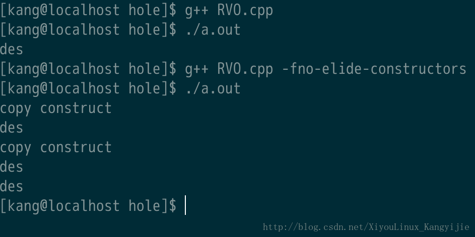

# 【C++踩坑】说说g++的-fno-elide-constructors参数

  

[XiyouLinux\_Kangyijie](https://me.csdn.net/XiyouLinux_Kangyijie) 2017-12-30 20:42:38  3463  收藏  8 

分类专栏： [小小总结](https://blog.csdn.net/xiyoulinux_kangyijie/category_6253393.html)

版权

### 前言

有时结果和你想的不一样，并不一定是你想错了。。。可能是编译器优化了。

### 正文

在给学弟讲题时遇到了这样一个问题，代码如下

```cpp
class A{
    public:
        A() = default;
        A(const A &a): str(a.str){ cout << "copy" << endl; }
        A(const string &d):str(d){ cout << "str" << endl; }

        string str;
};
void func(A a)
{
    cout << a.str << endl;
}
int main()
{
    func(string("hello world"));

}
```

大家想一想输出结果是什么？  
Ok，我的思路是这样的：  
首先调用std::string 的构造函数，通过一个字符串常量，构造了一个std::string对象，这个对象是个临时值，也就是说是个右值，我们叫它为string\_temp。

然后由于func的参数是一个A类型的对象，并且A有一个参数为const string &的构造函数，并且它没有explicit修饰，也就支持通过std::string隐式转换为A。那么在这里，便通过string\_temp构造出了一个A类型对象，同样是临时值（右值），我们叫它A\_temp。

但是因为func的参数是一个A类型的对象，并不是一个引用，所以应该调用拷贝构造函数将A\_temp拷贝到a。

OK让我们整理一下，这里发生了1次string的构造（string\_temp），1次A的构造(A\_temp)，1次A的拷贝构造(a)。

那么输出结果就应该是

```
str
copy
hello world
```

然而，我的g++（Fedora25 下的 6.3.1）编译后运行结果是这样的

```
str
hello world
```

难道我错了吗？

### 编译器的锅

在Axin一顿分析之后，他突然想到g++的-fno-elide-constructors参数，我表示这个参数是优化返回值的啊，和传参有啥关系，还是死马当成活马试试吧。

果然加上这个参数之后结果和我预期的一样。。。

之前曾经在RVO（Return Value Optimization）问题上见到过-fno-elide-constructors的效果，所以觉得这个参数只是影响返回值的优化，但是并不只如此。

### \-fno-elide-constructors的深入理解

这个参数只是针对C++的，man手册如下

> **\-fno-elide-constructors**
> 
> The C++ standard allows an implementation to omit creating a temporary that is only used to initialize another object of the same type. Specifying this option disables that optimization, and forces G++ to call the copy constructor in all cases.

大意如下：C++标准允许一种（编译器）实现省略创建一个只是为了初始化另一个同类型对象的临时对象。指定这个参数（-fno-elide-constructors）将关闭这种优化，强制G++在所有情况下调用拷贝构造函数。

ok，我们上面这个例子正是体现了这个参数所带来的优化，少调用了一次拷贝构造函数。  
可以说在C++11右值引用出现之前，C++的临时对象问题带来了非常大的性能开销，而编译器的这种优化，大大减少了很多无谓的copy，感觉对不是很懂C++的人是一种福音吧。比如你可能写出下面这样的代码：

```cpp
#include <iostream>
using namespace std;
class A{
    public:
    A() = default;
    A(const A&){cout << "copy construct" << endl;}
    ~A(){cout << "des" << endl;}
};
A f()
{
    return A();
}
int main(void)
{
    A o = f();
}
```

正常的流程是 构造临时对象1，调用copy构造生成临时对象2，再调用copy构造对象o，总共2次copy构造，生成了3个对象。  
如果这个A对象很大的话就很尴尬了。。。

但是编译器就很聪明了，结果如下：



可以看到直接把两次copy构造都优化掉了。。。  
所以说编译器默认都会优化的，如果只是用来初始化另一个同类型对象（比如传参传一个对象，比如return一个对象）能不copy构造就不copy构造。

在StackOverFlow上有一个问题，[为什么&什么时候使用`-fno-elide-constructors`参数](https://stackoverflow.com/questions/27086573/when-and-why-would-i-use-fno-elide-constructors)，下面的有一个comment挺好的

> 如果你的代码依赖于拷贝构造函数的副作用，那么你的代码就写的很烂。你编写的拷贝构造函数就应该保证这样的优化是安全的。

---------------------------------------------------


原网址: [访问](https://blog.csdn.net/XiyouLinux_Kangyijie/article/details/78939291)

创建于: 2020-08-25 19:31:43

目录: default

标签: `blog.csdn.net`

